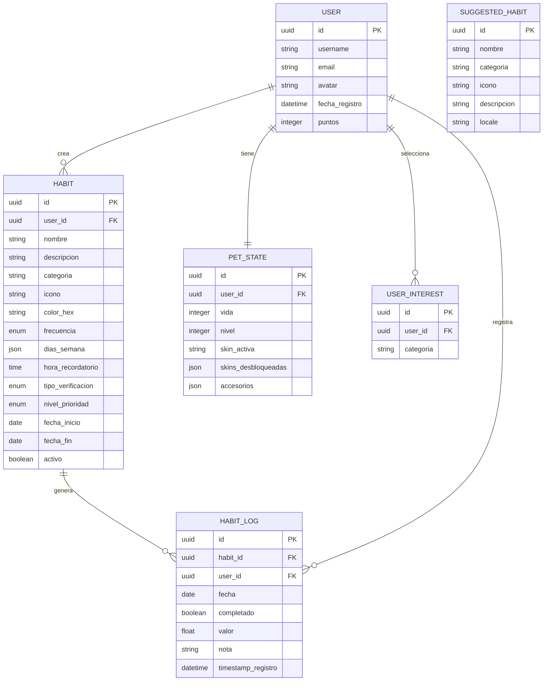

```mermaid
erDiagram
  USER {
    uuid id PK
    string username
    string email
    string avatar
    datetime fecha_registro
    integer puntos
  }
  HABIT {
    uuid id PK
    uuid user_id FK
    string nombre
    string descripcion
    string categoria
    string icono
    string color_hex
    enum frecuencia
    json dias_semana
    time hora_recordatorio
    enum tipo_verificacion
    enum nivel_prioridad
    date fecha_inicio
    date fecha_fin
    boolean activo
  }
  HABIT_LOG {
    uuid id PK
    uuid habit_id FK
    uuid user_id FK
    date fecha
    boolean completado
    float valor
    string nota
    datetime timestamp_registro
  }
  PET_STATE {
    uuid id PK
    uuid user_id FK
    integer vida
    integer nivel
    string skin_activa
    json skins_desbloqueadas
    json accesorios
  }
  SUGGESTED_HABIT {
    uuid id PK
    string nombre
    string categoria
    string icono
    string descripcion
    string locale
  }
  USER_INTEREST {
    uuid id PK
    uuid user_id FK
    string categoria
  }
  USER ||--o{ HABIT : "crea"
  HABIT ||--o{ HABIT_LOG : "genera"
  USER ||--o{ HABIT_LOG : "registra"
  USER ||--|| PET_STATE : "tiene"
  USER ||--o{ USER_INTEREST : "selecciona"
```
